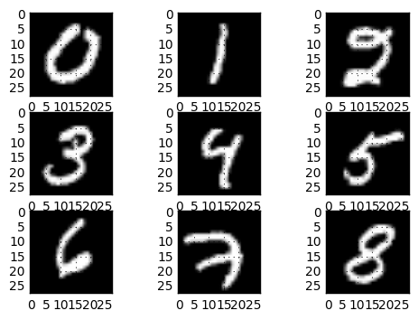

# MNIST Classification Methods
# 

This repository list and implements different ways to classify the MNIST dataset
including (but not limited to):
  - [Naive Bayes](Naive%20Bayes.ipynb)
  - [Gaussian Mixture Models](Gaussian%20Mixture%20Model.ipynb)
  - SVMs
  - Decision Trees
  - [Neural Networks](Neural%20Nets.ipynb)
  - Convolution Neural Networks

Some of the methods and algorithms to process the data as wells as
the classifiers include (but not limited to):
  - Kmeans
  - PCA
  - Boosting
  - Bagging

Some functions were inspired from tensorflow's tutorial.

Most of the code was writtent by [@orkat](https://github.com/Orkat) many thanks to him !
